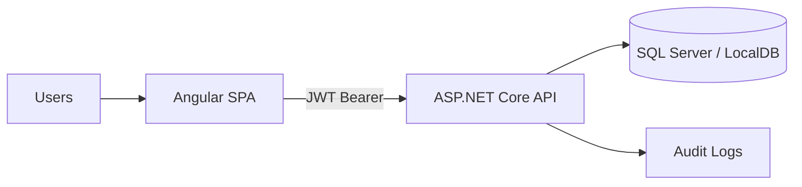
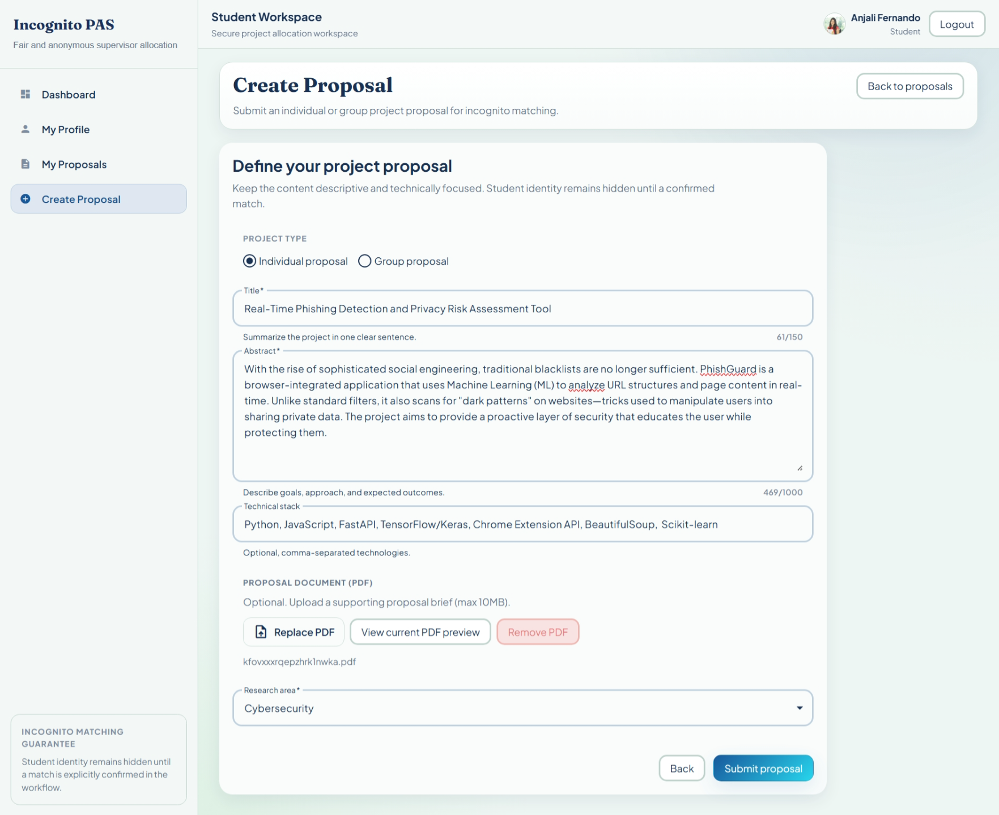
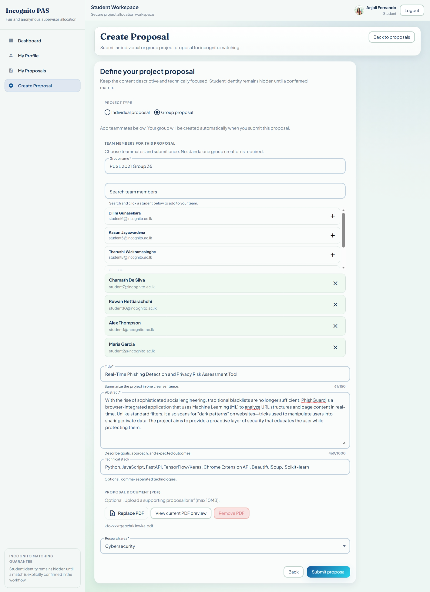

# Incognito PAS

Incognito PAS is a full-stack project approval and allocation platform that enforces blind student-supervisor matching.
It is designed for fairness, traceability, and operational clarity in academic project assignment workflows.

## Table of Contents

- [What This System Solves](#what-this-system-solves)
- [Core Capabilities](#core-capabilities)
- [Architecture](#architecture)
- [Technology Stack](#technology-stack)
- [Repository Structure](#repository-structure)
- [Role-Based UI and Routes](#role-based-ui-and-routes)
- [Getting Started](#getting-started)
- [Default Seed Accounts](#default-seed-accounts)
- [API Surface](#api-surface)
- [Testing and Quality](#testing-and-quality)
- [Troubleshooting](#troubleshooting)
- [UI Screenshot Gallery](#ui-screenshot-gallery)

## What This System Solves

Traditional project assignment processes are vulnerable to bias and coordination overhead.
Incognito PAS addresses this by introducing a strict blind matching flow where student identity remains hidden during review and is revealed only after a confirmed match.

## Core Capabilities

- Blind proposal review with identity-safe DTO contracts.
- Role-based portals for Student, Supervisor, Module Leader, and SysAdmin.
- Token-based authentication with role authorization policies.
- Structured proposal lifecycle states (`Pending`, `UnderReview`, `Matched`, `Withdrawn`).
- Match confirmation workflow with controlled identity reveal.
- Audit logging for operational traceability.
- Research area and user management for governance workflows.

## Architecture

Incognito PAS uses an API-first architecture:

- Backend: ASP.NET Core Web API + EF Core + ASP.NET Identity + JWT + Swagger
- Frontend: Angular standalone SPA + Angular Material + route guards + HTTP interceptor



### Blind Matching Rules

The workflow enforces these rules server-side:

1. Students submit proposals without exposing identity to supervisor browse flows.
2. Supervisors browse only blind proposal DTOs.
3. Supervisors express interest.
4. Identity is revealed only after valid match confirmation.
5. Module Leader can oversee and reassign confirmed matches through controlled endpoints.

## Technology Stack

| Layer | Technologies |
|---|---|
| Backend | .NET 10, ASP.NET Core Web API, EF Core, ASP.NET Identity, JWT Bearer, Swashbuckle |
| Frontend | Angular 18, Angular Material, RxJS, TypeScript |
| Data | SQL Server LocalDB / SQL Server |
| Testing | xUnit, FluentAssertions, Moq, EF InMemory, Angular/Karma |

## Repository Structure

```text
Incognito/
├── Controllers/Api/       # API controllers by domain/role
├── Data/                  # ApplicationDbContext and seed bootstrap
├── DTOs/                  # API DTO contracts
├── Models/                # Domain entities
├── Services/              # Business logic and interfaces
├── Migrations/            # EF Core migrations
├── frontend/              # Angular SPA
├── Program.cs             # App startup, auth, CORS, middleware, migrations
└── README.md              # This document
```

## Role-Based UI and Routes

### Public/Auth

- `/`
- `/auth/login`
- `/auth/register`
- `/auth/access-denied`
- `/**` (not found fallback)

### Student Workspace

- `/student`
- `/student/profile`
- `/student/proposals`
- `/student/proposals/:id`
- `/student/proposals/:id/edit`
- `/student/create`

### Supervisor Workspace

- `/supervisor`
- `/supervisor/profile`
- `/supervisor/browse`
- `/supervisor/interests`
- `/supervisor/confirmed`
- `/supervisor/expertise`

### Module Leader Workspace

- `/module-leader`
- `/module-leader/profile`
- `/module-leader/matches`
- `/module-leader/research-areas`
- `/module-leader/users`

### SysAdmin Workspace

- `/admin`
- `/admin/profile`
- `/admin/users`
- `/admin/migrations`
- `/admin/audit-logs`

## Getting Started

### Prerequisites

- .NET SDK 10.x
- SQL Server LocalDB (or SQL Server)
- Node.js 22.x
- npm 11.x

### 1) Configure backend settings

Check or update:

- `appsettings.json` connection string (`ConnectionStrings:DefaultConnection`)
- `appsettings.Development.json` for local overrides

Default LocalDB value:

```json
"DefaultConnection": "Server=(localdb)\\mssqllocaldb;Database=IncognitoPAS;Trusted_Connection=True;MultipleActiveResultSets=true"
```

### 2) Restore and run backend

From repository root:

```bash
dotnet restore Incognito/IncognitoPAS.csproj
dotnet run --project Incognito/IncognitoPAS.csproj
```

Notes:

- Backend launch profile uses `http://localhost:5232`.
- Swagger is enabled in `Development`.
- Startup automatically applies migrations and seeds initial data.

### 3) Install and run frontend

```bash
cd Incognito/frontend
npm install
npm start
```

Frontend URL:

- `http://localhost:4200`

The SPA is configured to call backend API at `http://localhost:5232`.

### 4) Build commands

```bash
# Backend
dotnet build Incognito/IncognitoPAS.csproj

# Frontend
cd Incognito/frontend
npm run build
```

Frontend production build output:

- `Incognito/frontend/dist/frontend`

## Default Seed Accounts

| Role | Email | Password |
|---|---|---|
| SysAdmin | admin@incognito.ac.lk | Admin@123456 |
| ModuleLeader | leader@incognito.ac.lk | Leader@123456 |
| Supervisor | supervisor1@incognito.ac.lk | Super@123456 |
| Supervisor | supervisor2@incognito.ac.lk | Super@123456 |
| Student | student1@incognito.ac.lk | Student@123 |
| Student | student2@incognito.ac.lk | Student@123 |
| Student | student4@incognito.ac.lk | Student@123 |

## API Surface

- `/api/auth/*`
- `/api/student/*`
- `/api/supervisor/*`
- `/api/moduleleader/*`
- `/api/admin/*`

## Testing and Quality

### Backend tests

```bash
dotnet test Incognito.Tests/Incognito.Tests.csproj
```

### Frontend tests (CI mode)

```bash
cd Incognito/frontend
npm run test:ci
```

### Last known backend test status

- `32 passed`
- `0 failed`

## Troubleshooting

### `dotnet run` fails at startup

- Verify SQL Server/LocalDB availability.
- Re-check `DefaultConnection` in `appsettings.json`.
- Ensure migration permissions are available to the current user.

### Frontend cannot reach backend

- Confirm backend is running on `http://localhost:5232`.
- Confirm frontend API base URL in `frontend/src/app/core/services/api.config.ts`.
- Ensure CORS policy is active and browser console shows no blocked origin errors.

### `npm start` or Angular build fails with memory errors

- Project scripts already use `--max_old_space_size=4096`.
- Close heavy processes and retry.
- Run `npm ci` for clean dependency install if needed.

## UI Screenshot Gallery

All UI screens are included below with dedicated image slots.
Current images are structured placeholders under `docs/ui-screenshots/` and can be replaced with real captures while keeping the same file names.

### Public and Auth

#### Landing


#### Login


#### Register


#### Access Denied


#### Not Found


### Student UI

#### Dashboard


#### Profile


#### Proposals List


#### Proposal Details


#### Proposal Edit


#### Proposal Create - Individual


#### Proposal Create - Group


### Supervisor UI

#### Dashboard


#### Profile


#### Browse Blind Proposals


#### Interests Queue


#### Confirmed Matches


#### Expertise


### Module Leader UI

#### Dashboard


#### Profile


#### Match Oversight


#### Research Areas


#### Users


### SysAdmin UI

#### Dashboard


#### Profile


#### Users


#### Migrations


#### Audit Logs


